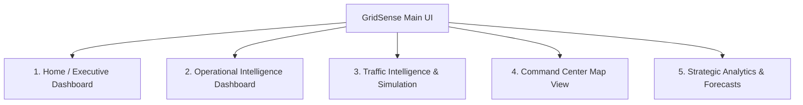

# GridSense - Front-End UI Blueprint

This document details the final frontend navigation structure and layout design for the GridSense Command Center. The navigation structure is consolidated into five core sections to maximize operator efficiency, separate high-confidence operational tools from strategic traffic simulations, and provide a clear executive status summary.

---

## Navigation Architecture

---

## 1. Home (Executive Dashboard)
The Home page acts as the operational nerve center. It provides high-level metrics, system health indices, financial cost approximations of active traffic delays, and weather-related warnings.

### 1. Widgets
* **System Status Health Indicator:** Real-time health status of backend APIs and database connections.
* **Active Incidents Counter:** Summary badge showing count of active low vs. high priority incidents.
* **Critical Corridors Warning Badge:** Number of corridors currently experiencing `Critical` stress (>80 score).
* **Live Pre-deployment Summary:** Count of police patrols and tow trucks currently pre-deployed.
* **Weather Alert Card:** Current IMD weather alert status (Green/Yellow/Red) with waterlogging risk warnings.

### 2. Charts
* **Monetary Delay Ticker:** Renders a ticker showing the accumulated cost of traffic congestion across the city today (in ₹ Lakhs).
* **Incident Frequency Trend (24h):** Bar chart comparing today's hourly incident count vs. historical weekly baseline.

### 3. Tables
* **Urgent Dispatch Incidents:** A compact list of active incidents flagged as High Priority that are waiting for response units.
* **Active Pre-deployment Plans:** A list showing currently active weather-driven pre-deployment rosters.

### 4. API Calls
* `GET /api/v1/health` - Feeds the System Status Widget.
* `GET /api/v1/incidents?status=active` - Feeds active incident counts and the urgent list.
* `GET /api/v1/surge/vulnerability` - Pulls active weather warning states.
* `POST /api/v1/intelligence/congestion-cost` (aggregate) - Provides data for the daily monetary delay ticker.

### 5. User Interactions
* **Click Urgent Incident:** Redirects the operator to the *Operational Intelligence* screen with the clicked incident pre-selected.
* **Trigger Weather Pre-deployment:** Interactive button to manually initiate the storm response deployment flow.
* **Toggle Ticker Mode:** Switches the cost ticker display between total fuel cost, idle cost, and driver delay penalty.

---

## 2. Operational Intelligence
Designed specifically for dispatchers, this page groups real-time triage, priority correction, duration lookups, and automated patrol routing.

### 1. Widgets
* **Selected Incident Detail Card:** Visualizes all properties of the active incident (cause, vehicle type, time logged).
* **Road Closure Risk Indicator:** Dial gauge showing the probability of physical road closure, highlighting the `0.35` threshold.
* **Clearance Duration Estimate Card:** Shows median, 25th percentile, and 75th percentile expected clearance times.
* **Police Station Load Meters:** Radial progress bars displaying the active incident workload of neighboring stations.

### 2. Charts
* **Bias-Correction Divergence Panel:** Comparative text/progress indicators showing historical dispatcher priority classification vs. GridSense's model prediction.
* **Clearance PDF Curve:** Distribution chart of historical clearance times for the selected incident cause, marking the current estimated window.

### 3. Tables
* **Active Incident Queue:** A sortable list of all unresolved incidents, highlight-coded by model priority.
* **Recommended Response Units Table:** Ranked list of police stations, showing dispatch distance, current unit load, and recommendation score.

### 4. API Calls
* `GET /api/v1/incidents` - Refreshes the active incident queue.
* `POST /api/v1/predict/triage` - Submits incident parameters to get closure risk, priority predictions, and clearance duration estimates.
* `POST /api/v1/deploy/recommend` - Calculates optimal police station and officer buffer configurations.

### 5. User Interactions
* **Select Queue Incident:** Updates the entire dashboard to display the selected incident's metrics.
* **Confirm Priority Override:** Allows the dispatcher to manually confirm or override the priority recommendations.
* **One-Click Dispatch Button:** Sends the recommended patrol unit allocation to the database, removing the incident from the triage queue.

---

## 3. Traffic Intelligence & Simulation
Targeted at traffic engineers and logistics analysts (e.g., Flipkart LCV routers), this page houses network-wide simulation controls, planned event modeling, detours, and cost calculators.

### 1. Widgets
* **Cascade Planner Scheduler:** Input form to set up planned events (cause, corridor, day, time).
* **Logistics Route Input Card:** Form to compute commercial vehicle route cost (fuel mileage, idle fuel rate, driver value of time).
* **Domino Simulation Control Panel:** Parameters slider to inject volume and block capacity on a selected source road.

### 2. Charts
* **Road Stress Factor Radar Chart:** Shows contributing percentages to a corridor's stress score (density, speed drop, weather, centrality).
* **Domino Progressive Delay Curve:** Line chart showing cumulative city-wide congestion increase over a 30-minute simulation.

### 3. Tables
* **Safe Diversions Detour Table:** Lists open alternative routes, safe time windows, and detour stress levels.
* **Logistics Route Cost Comparison Table:** Side-by-side comparison of normal vs. congested route paths, showing fuel liters, idling costs, and delay penalties.
* **Shockwave Spread Forecast Queue:** Timeline list showing neighboring corridors, distance hops, and minutes-to-impact (5, 15, 30 min).

### 4. API Calls
* `POST /api/v1/predict/cascade` - Computes multiplier effects of planned events.
* `POST /api/v1/intelligence/road-stress` - Retrieves multi-factor stress indicators.
* `POST /api/v1/intelligence/shockwave` - Computes queue backups and spread vectors.
* `POST /api/v1/intelligence/vehicle-surge` - Returns net vehicle accumulation rate indicators.
* `POST /api/v1/intelligence/domino` - Runs step-by-step cascade spillover simulations.
* `POST /api/v1/intelligence/congestion-cost` - Runs alternative route financial calculations.

### 5. User Interactions
* **Simulate Planned Work:** Input an upcoming construction project and press "Run Cascade" to evaluate spillover risk.
* **Run Domino Slider:** Drag a slider representing the percentage of blocked capacity to see secondary road collapses update in real time.
* **Adjust Fleet Fuel Price:** Input field to adjust fuel prices or vehicle mileage coefficients to recalculate logistics cost tables.

---

## 4. Map View
A full-screen spatial canvas that aggregates all geospatial intelligence layers, vector directions, and heatmaps.

### 1. Widgets
* **Layer Control Sidebar:** Panel to toggle map layers (Incident Pins, Police Station Locations, Corridor Stress Segments, Risk Heatmaps, Shockwave Vector arrows).
* **Geospatial Search Bar:** Auto-completes named corridors, junctions, and coordinates.
* **Live Legend Panel:** Visual key explaining line thicknesses, color scales, and icon glyphs.

### 2. Charts
* **Corridor Stress Mini-Sparkline:** Shows a small historic 12-hour stress trend chart inside the popup when a map corridor is hovered.

### 3. Tables
* **Corridor Attributes Popup Table:** Displays speed drop %, capacity, and connectivity coordinates for the selected segment.

### 4. API Calls
* `GET /api/v1/corridors` - Pulls the static network graph coordinates.
* `GET /api/v1/incidents?status=active` - Pulls live coordinates of active incidents.
* `GET /api/v1/surge/vulnerability` - Pulls weather vulnerability coefficients for color-coding the corridors.

### 5. User Interactions
* **Toggle Map Layer overlays:** Turn on/off heatmaps or shockwave circles.
* **Hover Corridor segment:** Displays a tooltip containing the stress index and historical speed drop.
* **Click Map Incident Pin:** Opens the triage details card directly in a floating panel on the map screen.

---

## 5. Strategic Analytics & Forecasts
Focused on long-term infrastructure improvements, time-series forecasting, and police performance audits.

### 1. Widgets
* **Strategic Filter Panel:** Dropdowns to select junctions, corridors, and date ranges.
* **Blackspot Tier Summary Badges:** Displays counts of junctions classified as Chronic, Critical, At Risk, or Monitored.
* **Neglect Threshold Alert:** Highlights police stations with average response times exceeding the $5\times$ clearance limit.

### 2. Charts
* **72-Hour Incident Forecast Line Chart:** Displays predicted incident volume trends with shaded Prophet uncertainty intervals ($80\%$).
* **Junction Risk Factor Share Pie Chart:** Cause distribution breakdown (accidents, vehicle breakdowns, waterlogging) for the selected chronic junction.

### 3. Tables
* **Top 10 Chronic Blackspots Leaderboard:** Ranked table of intersections by overall risk index score, showing total incidents and weekly recurrence rates.
* **Station Response Neglect Leaderboard:** Table of police stations sorted by their Neglect Index rating, showing actual vs. expected clearance times.

### 4. API Calls
* `GET /api/v1/forecast/junction/{junction}?hours_ahead=72` - Feeds the Prophet time-series line chart.
* `GET /api/v1/blackspot/junctions` - Retrieves ranked chronic blackspots.
* `GET /api/v1/blackspot/neglect` - Pulls the station response neglect database logs.

### 5. User Interactions
* **Select Forecast Junction:** Updates the Prophet forecast timeline graph.
* **Filter Leaderboard by Tier:** Toggles the blackspot table between Chronic, Critical, and At Risk intersections.
* **Export Audit Data:** Action button to download the station neglect leaderboard as a CSV report.
